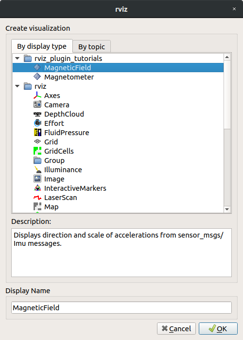
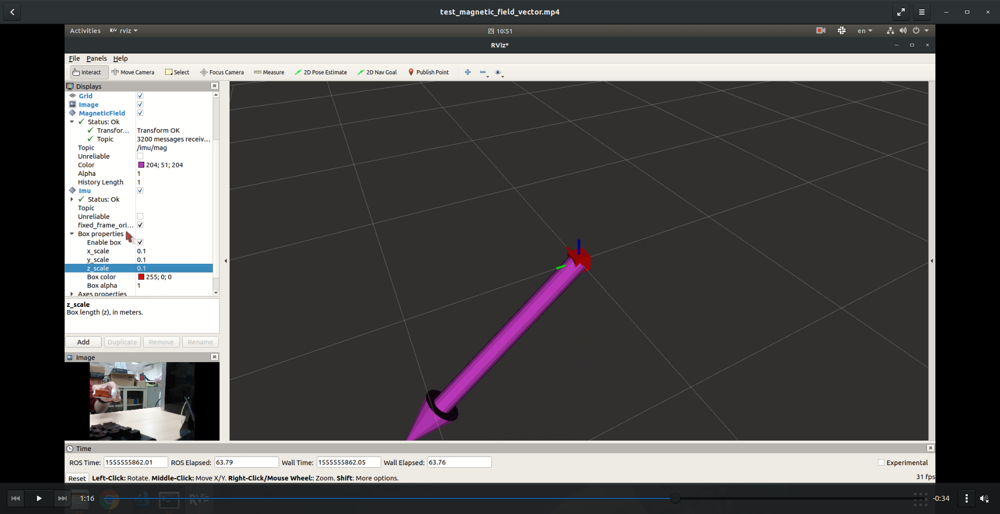

# Prerequisite
###
* X-Sense IMU
* Install ROS (this tutorial test on both ROS-melodic and ROS-kinetic)
* Pull this repository
* Install ros-melodic-rviz-imu-plugin (for showing the Pose of IMU)

  `$ sudo apt install ros-melodic-rviz-imu-plugin`
###
# Start
* Access the authority of USB port for X-Sense

Copy the rules file to below path and reboot computer

`$ sudo cp scripts/60-xsense.rules /etc/udev/rules.d/`

Now if you type `$ ls /dev/|grep Xsense-imu` in terminal, you should see `Xsense-imu` in red color

* Run the Xsense

>`$ roslaunch xsens_driver xsens_driver.launch`

* Open RViz

>`$ rviz`

>* Choose Fixed frame to `imu`

>* Add MagneticField Display
>> 

* Now You should see the result like this

